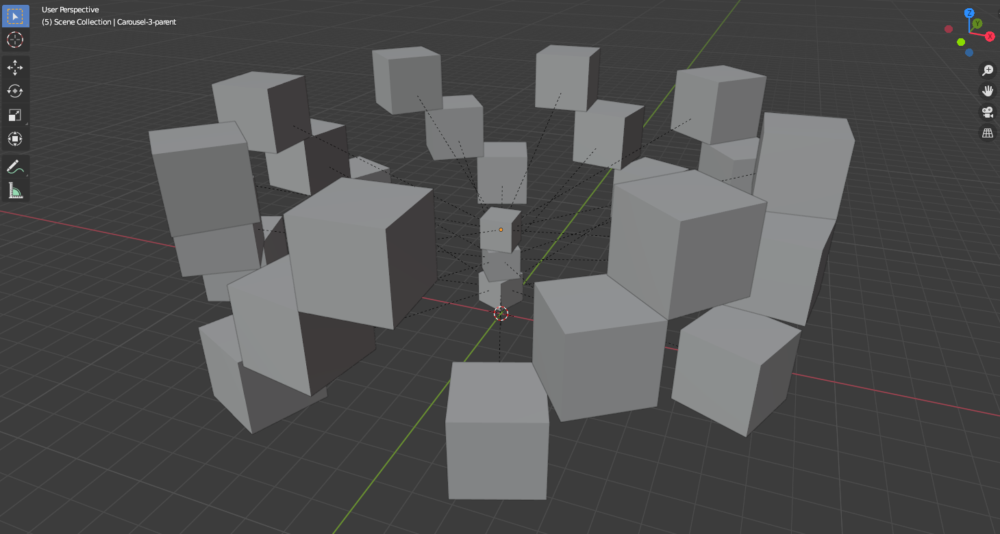

# Blender Addon: Carousel

Simple Blender addond that generates 1-n carousels and animates them
to have different combos.

**Usage**

- Install plugin: `carousel.py`
- Invoke the method in Python shell: `bpy.ops.object.carousel_add()` (see optional parameters below)

Parameters:

| Name          | Desc                                         |
| ------------- | -------------------------------------------- |
| object_type   | Object type to put on carousel: cube, grease |
| object_count  | Numbers of object to generate. Defaults to 8 |
| circle_radius | Size of the circle. Defaults to 8            |
| circle_count  | Number of circles to stack. Defaults to 1    |
